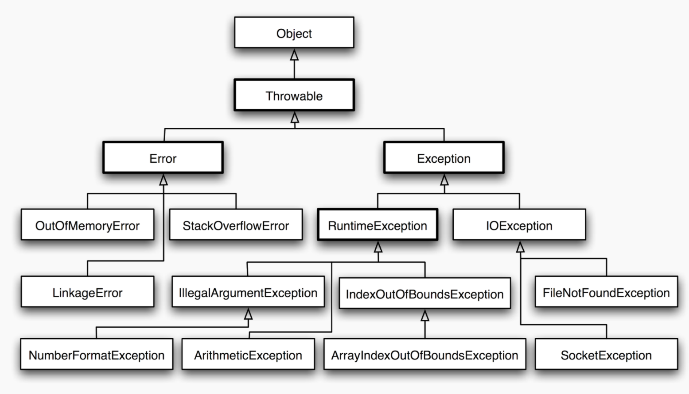

## What is an Exception?

Exception is an event that our program may encounter. Importantly, as a programmer, you too can create them to warn yourself or other programmers about what went wrong in your program.

## Basic error and exception structure

### Throwable class

As you know, every object in Java inherits from the Object class, and the exception is nothing other than an object - so you should not be surprised that the Object class is at the very top of our structure. It does not change the fact that the most interesting at the moment is the Throwable class, which is new to you. This is the class that inherits any Java bug - this is very important as only classes that inherit from Throwable can be considered Java bugs.

### Error

This is the most serious bug in Java, we should not try to handle it because it occurs in critical situations and it is even recommended that the Java application stop in such a situation. Examples of this type of error are:

Total capacity of the memory available for the program,
Excess recursive calls

There are of course more such errors - if you want to take a closer look at them, see [here] (! Https: //docs.oracle.com/en/java/javase/11/docs/api/java.base/java/lang/Error .html)

### Exception – checked

Exception is an exception that may appear while the program is running or calling a method and must be handled by the programmer, which we will talk about in a moment. Exceptions are often used when there is a high probability of an undesirable situation in the application - instead of allowing it to happen, we leave the program to an alternative course of action, which it should take when something we do not want occurs.

An example of an Exception exception is IOException, which handles exceptions related to data input and output (that is, for example, writing to and reading from a file). Such an exception must be handled by the programmer, because there is a probability that - for example - the file from which we want to read the text may not exist within our application - in such a situation we may want to e.g. cancel the reading from the file and display information about the problem.

### RuntimeException – unchecked

This is the kind of exception in Java that doesn't need to be handled by the developer. It may appear while the program is running. An example of such an exception is - IllegalArgumentException - an error that appears, for example, when a method that expects an argument of the int type is passed an argument of the String type

## Summing up

Checked exceptions are exceptions that inherit from the Exception class and need to be handled by the developer, which we'll talk about shortly.

Unchecked exceptions are those that inherit from the RuntimeException class and do not need to be handled, but this may result in the program stopping.