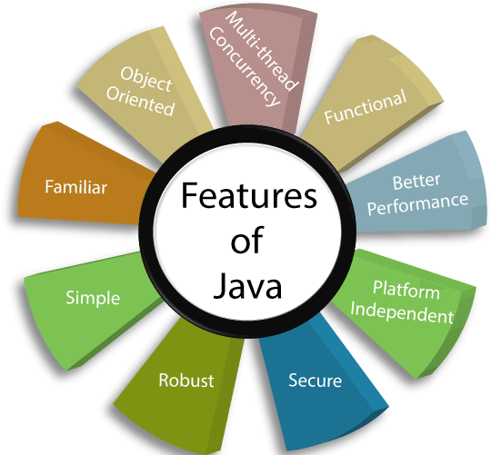

## Long story short

Java has been with us since 1995 and is a programming language designed to build web applications, programs that you can install on your computer and other devices. Such programs can be run on many platforms, e.g. Windows, Linux, Mac OS X (Apple) operating systems or on an Android phone (as a mobile application). Java was developed by Sun and then purchased by Oracle.

Java has undergone many modifications since 1995. Since then, subsequent versions marked with the appropriate number have been released (the newest is Java version 14, which appeared relatively recently and is not yet a "fixed" version). Some versions of Java are referred to as LTS (Long Term Support) - these versions are used by software companies on a daily basis. The rest are not supported by Java developers for more than a few months and are treated as "experimental" versions allowing you to see which changes developers like and don't like. LTS versions are released every few years. The last LTS released is Java 11 (the previous one was Java 8, also known as Java 1.8) and this state will not change almost until the end of 2021, when the next LTS is planned to be released, i.e. version 17.

## Main features of Java

Java is known for its:

- flexibility - it allows you to create one application without creating many separate versions for different devices at the same time; it is possible to program one version in Java, which will work, for example, on many computers with different operating systems, which significantly saves time and increases the number of devices on which the application can be run (range)!
- scalability - it should be understood as the ability to run applications that can adapt to a large number of users during operation. A language that is scalable can perform well for small as well as large data operations. Imagine an application used by 100 people. However, the marketing department promoted the new functionality so well that 100 visitors turned into almost 100,000 new users. A scalable application is able to adapt to such a number and continue to run smoothly!
- easy to maintain - Java code "built-in" standards enforce its transparency. Each member of the development team has certain coding rules "imposed" by Java, which allows for easier mutual understanding of the code. Thanks to this, we avoid the mess in the code and the nerves of programmers who take over the code after someone.
